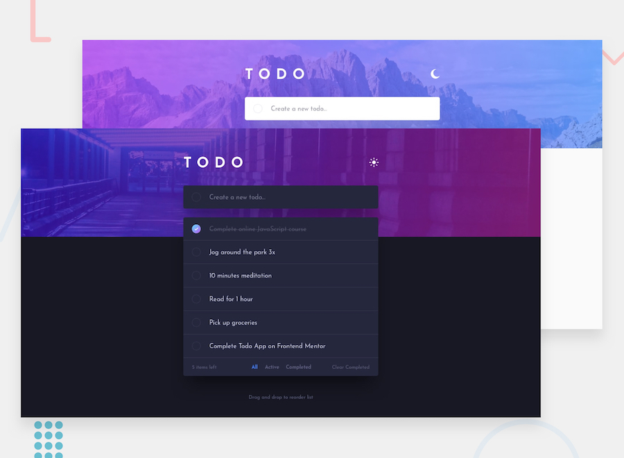
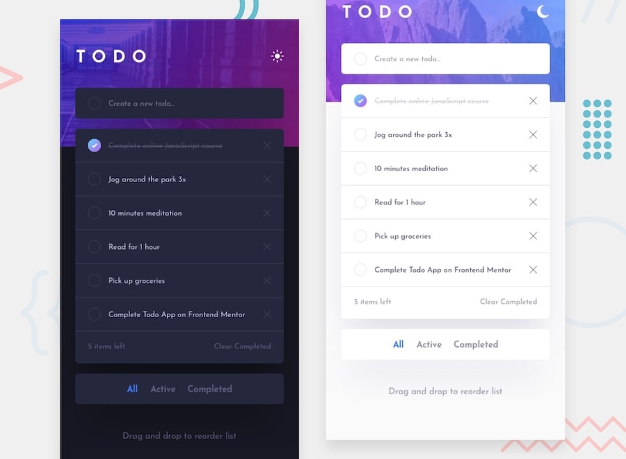

# Todo app

## The challenge

The classic todo app with a few twists! This app includes a dark/light theme toggle and drag & drop reordering for anyone wanting an extra test.

Users should be able to:

- View the optimal layout for the app depending on their device's screen size
- See hover states for all interactive elements on the page
- Add new todos to the list
- Mark todos as complete
- Delete todos from the list
- Filter by all/active/complete todos
- Clear all completed todos
- Toggle light and dark mode
- **Bonus**: Drag and drop to reorder items on the list

## Screenshots

